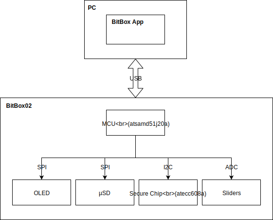

The BitBox02 is a hardware wallet that simplifies secure handling of crypto coins through storing
private keys and signing transactions. The content of this repository is the bootloader and
firmware used on the device. The BitBox02 is meant to be used primarily with the [BitBox
App](https://github.com/digitalbitbox/bitbox-wallet-app), although third party integration is
possible through the BitBox02 API.

The main functionality of the firmware is the following:

* Safely receive and send coins.
* Interacting with the user through touch sliders and a display.
* Back up the seed to a microSD card.
* Back up the seed by displaying the BIP39 mnemonic encoding on the screen.
* Import 12, 18 or 24 word BIP39 mnemonics
* Generate a random seed from multiple strong sources of entropy.
* Protect the seed from attackers.
* Derive keys from the seed according to BIP39 and BIP32.
* Return the extended public key for a keypath so that the app can find all unspent transaction
  outputs.
* Display the receive address for the keypath, coin and script/address type.
* Display the receive address, transaction amount and network fee and sign each input after
  confirmation.

## Architecture

The main chip on the device is the microcontroller from Microchip (atsamd51j20a). This chip is used
for communication to the BitBoxApp via USB, to the user via the sliders and to the secure element
(atecc608a) via I2C.

### Sliders

The sliders along the edges of the device are used for user input.  There are three input gestures:
* Tap
* Slide
* Hold to confirm

### USB

The USB communication is implemented using the request-response pattern with enecrypted protobuf
messages. The encryption protocol used is Noise with out-of-band authentication.

### Hardware docs

[PCB schematics v2.1](./doc/bb02_v2.10_schematics.pdf)

[PCB bill of materials (BOM) v2.1](./doc/bb02_bom_v2.10.pdf)

[PCB x-ray v2.1](./doc/bb02_xray_v2.10_top_pcb.png)

## Contributing

The instructions for setting up a development environment can be found in [BUILD.md](BUILD.md).
Please also read our [CONTRIBUTING.md](CONTRIBUTING.md) before filing issues and pull requests.

## Reporting a vulnerability

See our [security policy](SECURITY.md).
